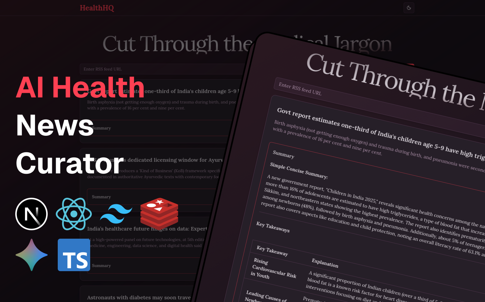
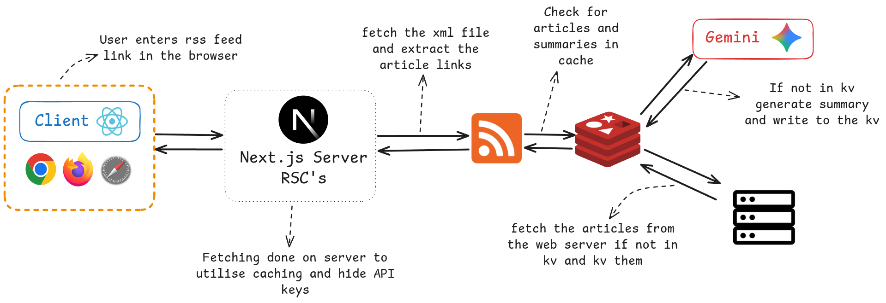

 

# HealthHQ

HealthHQ is a Next.js (App Router) app that ingests RSS/Atom feeds, fetches
full article content, sanitizes it (Readability + DOMPurify), and generates AI
summaries & rewrites using Google Gemini via `ai` SDK. Content and summaries
are cached in Upstash Redis.

## Features
- Feed ingestion with `@extractus/feed-extractor`
- Article extraction + absolute URL rewriting
- Sanitization (DOMPurify) before rendering
- AI summary + rewrite (Gemini) with markdown formatting
- Redis caching (24h) for article + summary
- Dark / light theme toggle

## Architecture Notes
- Summaries cached per article link with `<url>:summary`
- Articles cached as `<url>:article`
- Summaries generated lazily; cache writes are fire-and-forget (`void`)
- Validation with `zod`; server actions return structured objects

 

## Getting Started

First, ensure you have [Node.js](https://nodejs.org/en/download/) installed (v18+ recommended).

Then, clone the repository:

```bash
git clone https://github.com/harsh-m-patil/healthhq.git
cd healthhq
```
Install dependencies (PNPM preferred):

```bash
pnpm install
```

Run the development server:

```bash
pnpm dev
```

Open http://localhost:3000.

Key entry points:
- UI pages: `src/app/*`
- Server actions: `src/lib/actions.ts`
- AI helpers: `src/lib/ai.ts`
- Article & feed logic: `src/lib/article.ts`, `src/lib/feed.ts`

## Commands
```bash
pnpm dev      # run locally (Turbopack)
pnpm build    # production build
pnpm start    # start production server
pnpm lint     # Biome check
pnpm format   # Biome format write
```

## Environment Variables
Set (e.g. in `.env.local`):
- `GOOGLE_GENERATIVE_AI_API_KEY` (Gemini via `@ai-sdk/google`)
- `UPSTASH_REDIS_REST_URL`
- `UPSTASH_REDIS_REST_TOKEN`


## Learn More

To learn more about Next.js, take a look at the following resources:

- [Next.js Documentation](https://nextjs.org/docs) - learn about Next.js features and API.
- [Learn Next.js](https://nextjs.org/learn) - an interactive Next.js tutorial.

Refer to `AGENTS.md` for contributor conventions (imports, naming, error handling).

## Deploy on Vercel

The easiest way to deploy your Next.js app is to use the [Vercel Platform](https://vercel.com/new?utm_medium=default-template&filter=next.js&utm_source=create-next-app&utm_campaign=create-next-app-readme) from the creators of Next.js.

Check out our [Next.js deployment documentation](https://nextjs.org/docs/app/building-your-application/deploying) for more details.
